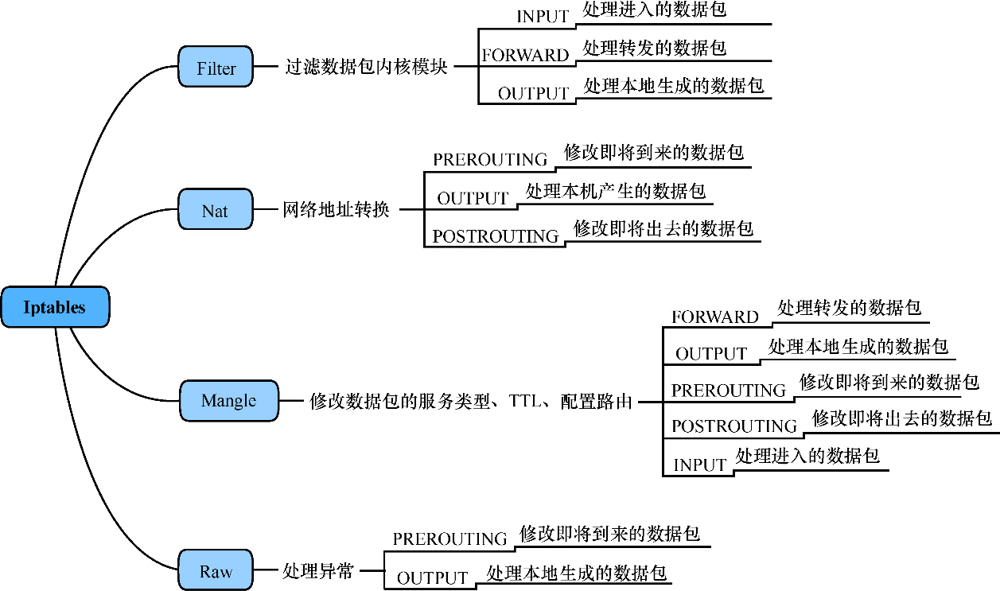
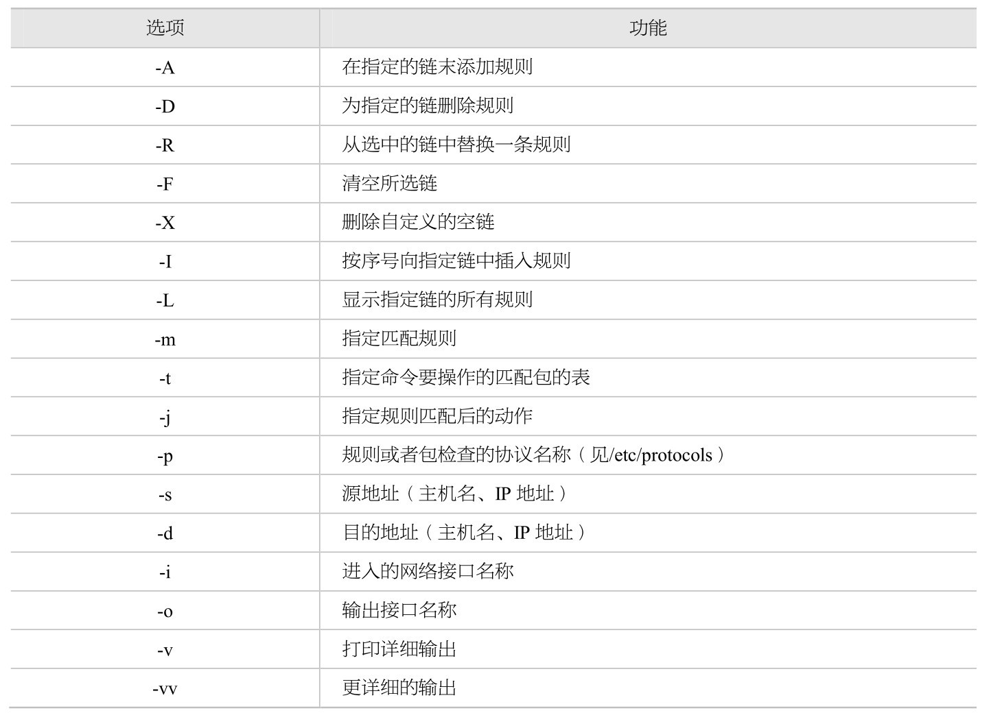

### 信息安全

信息安全包括5个基本要素：机密性、完整性、可用性、可控性与可审查性。
- 机密性：确保信息不暴露给未授权的实体或进程。
- 完整性：只有得到允许的人才能修改数据，并且能够判别出数据是否已被篡改。
- 可用性：得到授权的实体在需要时可访问数据，即攻击者不能占用所有的资源而阻碍授权者的工作。
- 可控性：可以控制授权范围内的信息流向及行为方式。
- 可审查性：对出现的网络安全问题提供调查的依据和手段。

### 常见网络协议如下:

- `ARP`：地址解析协议(Address Resolution Protocol)，将`IP`地址解析成`MAC`地址。
- `DNS`：域名解析协议。通过域名，最终得到该域名对应的`IP`地址的过程称为域名解析。
- `SNMP`：网络管理协议(Simple Network Management Protocol)。
- `DHCP`：动态主机配置协议(Dynamic Host Configuration Protocol)，`TCP/IP`网络上使客户机获得配置信息的协议。
- `FTP`：文件传输协议(File Transfer Protocol)，是一个标准协议，是在计算机和网络之间交换文件的最简单的方法。
- `HTTP`：超文本传输协议(Hypertext Transfer Protocol)。
- `HTTPS`：安全超文本传输协议(Secure Hypertext Transfer Protocol)，是由`Netscape`开发并内置于其浏览器中，用于对数据进行压缩和解压操作。
- `ICMP`：互联网控制报文协议(Internet Control Message Protocol)。
- `PING`：`Ping`命令使用`ICpop`，命令使用格式为`ping ip`，定义的消息类型有`TTL`超时、地址的请求与应答、信息的请求与应答、目的地不可到达。
- `SMTP`：简单邮件传送协议(Simple Mail Transfer Protocol)。
- `TELNET Protocol`：虚拟终端协议。
- `TFTP`：小文件传输协议(Trivial File Transfer Protocol)。
- `UDP`：用户数据报协议(User Datagram Protocol)，是用来在互联网环境中提供包交换的计算机通信协议。
- `TCP`：传输控制协议(Transmission Control Protocol)，是一种面向连接的、可靠的、基于字节流的传输层通信协议。


### 常见的`sysctl`设置

- `net.ipv4.tcp_syncookies=1`表示开启`SYN Cookies`，当出现`SYN`等待队列溢出时，启用`cookie`来处理，可防范少量的`SYN`攻击，默认为`0`，表示关闭；
- `net.ipv4.tcp_tw_reuse=1`表示开启重用，即允许将`TIME-WAIT sockets`重新用于新的`TCP`连接，默认为`0`，表示关闭；
- `net.ipv4.tcp_tw_recycle=1`表示开启`TCP`连接中`TIME-WAIT sockets`的快速回收，默认为`0`，表示关闭；
- `net.ipv4.tcp_fin_timeout=30`表示如果套接字由本端要求关闭，这个参数决定了它保持在`FIN-WAIT-2`状态的时间；
- `net.ipv4.tcp_keepalive_time=1200`表示当`keepalive`启用时，`TCP`发送`keepalive`消息的频度默认是`2`小时，改为`20`分钟；
- `net.ipv4.ip_local_port_range=1000065000`表示`CentOS`系统默认向外连接的端口范围。默认值很小，这里改为`10000`到`65000`。建议这里不要将最低值设得太低，否则可能会占用正常的端口。
- `net.ipv4.tcp_max_syn_backlog=8192`表示`SYN`队列的长度，默认为`1024`，加大队列长度为`8192`，可以容纳更多等待连接的网络连接数。
- `net.ipv4.tcp_max_tw_buckets=5000`表示系统同时保持`TIME_WAIT`套接字的最大数量，如果超过这个数字，TIME_WAIT套接字将立刻被清除并打印警告信息，默认为`180000`，改为`5000`。对于`Apache`、`Nginx`等服务器，前面介绍的几个的参数已经可以很好地减少`TIME_WAIT`套接字数量，但对于`Squid`来说效果不大，有了此参数就可以控制`TIME_WAIT`套接字的最大数量，避免`Squid`服务器被大量的`TIME_WAIT`套接字拖死。


### `iptables`





```bash
$ sudo iptables -t nat -nL

$ ansible -m script -a 'scripts/iptables-reset.sh' -i hosts all -u deploy --become -v
```

### `LVS`

```bash
$ sudo ipvsadm -Ln

$ ansible -m script -a 'scripts/kubernetes-service.sh' -i hosts all -u deploy --become -v
```

### 网络相关内核模块

内核模块位置：/lib/modules/`uname -r`/kernel

| 内核模块       | 描述    | 位置                                 |
| ------------ | ------- | ------------------------------------ |
| br_netfilter |         | `net/bridge/br_netfilter.ko`         |
| bridge       |         | `net/bridge/bridge.ko`               |
| nf_conntrack |         | `net/netfilter/nf_conntrack.ko`      |
| ip_set       |         | `net/netfilter/ipset/ip_set.ko`      |
| xt_set       |         | `net/netfilter/xt_set.ko`            |
| ip_tables    |         | `net/ipv4/netfilter/ip_tables.ko`    |
| ipt_rpfilter |         | `net/ipv4/netfilter/ipt_rpfilter.ko` |
| ipt_REJECT   |         | `net/ipv4/netfilter/ipt_REJECT.ko`   |
| ipip         |         | `net/ipv4/ipip.ko`                   |


> `linux kernel 4.19`版本已经将`nf_conntrack_ipv4`更新为`nf_conntrack`。

```bash
cat /lib/modules/$(uname -r)/modules.dep

# 修改linux的内核参数，添加网桥过滤和地址转发功能
cat <<EOF > /etc/sysctl.d/k8s.conf
net.bridge.bridge-nf-call-ip6tables = 1
net.bridge.bridge-nf-call-iptables = 1
net.ipv4.ip_forward = 1
EOF
```

#### `IPVS`支持的算法

| 序号 | 标识   | 详细说明            | 模式             | 内核模块       |
| ---- | ----- | ----------------- | ---------------- | -------------- |
| 01   | rr    | Round Robin 轮询  | Static Schedule  | ip_vs_rr.ko    |
| 02   | wrr   | Weight Round Robin 加权轮询 | Static Schedule  | ip_vs_wrr.ko   |
| 03   | sh    | Source Hashing 源地址Hash实现会话绑定(Session Affinity)   | Static Schedule  | ip_vs_sh.ko    |
| 04   | dh    | Destination Hashing 目标地址Hash         | Static Schedule  | ip_vs_dh.ko    |
| 05   | lc    | Least-Connection Scheduling 最少连接     | Dynamic Schedule | ip_vs_lc.ko    |
| 06   | wlc   | Weighted Least-Connection Scheduling):加权最少连接  | Dynamic Schedule | ip_vs_wlc.ko   |
| 07   | sed   | shortest expected delay scheduling 最少期望延迟  | Dynamic Schedule | ip_vs_sed.ko   |
| 08   | nq    | Never Queue Scheduling 永不排队   | Dynamic Schedule | ip_vs_nq.ko    |
| 09   | LBLC  | Locality-Based Least Connections 基于局部性的最少连接  | Dynamic Schedule | ip_vs_lblc.ko  |
| 10   | LBLCR | Locality-Based Least Connections with Replication 基于局部性的带复制功能的最少连接  | Dynamic Schedule | ip_vs_lblcr.ko |
| 11   | fo    | Weighted Fail Over 遍历虚拟服务所关联的真实服务器链表，找到还未过载(未设置IP_VS_DEST_F_OVERLOAD标志)的且权重最高的真实服务器，进行调度  | Dynamic Schedule | ip_vs_fo.ko    |
| 12   | OVF   | Overflow-connection 调度算法 遍历虚拟服务相关联的真实服务器链表，找到权重值最高的可用真实服务器。一个可用的真实服务器需要同时满足以下条件：1. 未过载(未设置IP_VS_DEST_F_OVERLOAD标志)真实服务器2. 当前的活动连接数量小于其权重值 3.其权重值不为零 | Dynamic Schedule | ip_vs_ovf.ko   |


`LVS`提供了十种不同的负载均衡调度算法

1.  轮询(`Round Robin`)
    > `LB`将外部请求按顺序轮流分配到集群中的各个`RS`上。这种算法会均等地对待每一个`RS`，而不管这个`RS`上实际的连接数和系统负载情况。
2.  加权轮询(`Weighted Round Robin`)
    > `LB`会根据RS的不同处理能力来调度访问请求。这样可以保证处理能力强的`RS`处理更多的访问流量。`LB`可以自动询问`RS`的负载情况，并动态地调整其权值。
3.  最少链接(`Least Connections`)
    > `LB`动态地将网络请求分配给活动链接数最少的`RS`上。如果集群中的`RS`具有相似的性能，采用"最少链接"算法可以获得较好的负载均衡效果。
4.  加权最少链接(`Weighted Least Connections`)
    > 在集群系统中`RS`性能差异较大的情况下，`LB`采用"加权最少链接"调度算法能够优化负载均衡的性能。具有较高权值的`RS`将承受较大比例的活动链接负载。`LB`可以自动询问`RS`的负载情况，并动态地调整其权值。
5.  最小期待延迟(`Shortest Expected Delay`)
    > 该调度算法基于前述的`WLC`调度算法，但是会对`WLC`遇到的一种特殊情形做处理。比如有`A`、`B`、`C`三个`RS`的权重分别是`1`、`2`、`3`，而活动链接数也是`1`、`2`、`3`，那么根据`WLC`算法计算则三个`RS`都是备选对象，这时`WLC`会利用随机数来做任意选择。而`SED`则会选择`C`，因为它所使用的公式是`(Ci+1)/Ui`，其中`Ci`代表活动链接数，`Ui`代表权值。这个算法可以在这种情形下判断出实际能力更强的`RS`，那么将请求分配给它则代表拥有最小的延迟。
6.  最少队列(`Never Queue`)
    > 该算法是对`SED`算法的一个调整。当`LB`发现有`RS`已经没有活动链接了，则立即将用户请求转发给它，而除此之外，则运用`SED`算法。如果不采用`NQ`算法，那么`SED`算法很可能导致某些性能较差的`RS`永远都得不到用户的请求，这就破坏了负载均衡的均衡性。
7.  基于局部性的最少链接(`Locality-Based Least Connections`)
    > 这种调度算法是针对目标`IP`地址的负载均衡，目前主要用于缓存(比如`Memcache`、`Redis`等)集群系统中。该算法根据请求的目标`IP`地址找出该目标`IP`地址最近使用的`RS`，若该`RS`是可用的且没有超载，则将请求转发到该`RS`上；若这样的`RS`不存在，或该`RS`超载且有`RS`处于`50%`的工作负载，则采用"最少链接"原则选出一个可用的`RS`，并将该请求发送到这个`RS`。对于缓存类集群，这样的调度算法可以尽最大可能的满足缓存命中或一致性的需求。
8.  带复制的基于局部性的最少链接(`Locality-Based Least Connections with Replication`)
    > 这种调度算法与前述的`LBLC`算法差不多，也主要是用于缓存集群中。不同之处在于，该调度算法要维护一个目标`IP`地址到一组RS的映射，而`LBLC`则是一对一的映射。该算法根据请求的目标`IP`地址找出目标IP地址对应的RS组，然后再按照"最小链接"原则从这组`RS`中选出一个来，若没有超载则将请求转发；若超载了，则继续按照"最小链接"原则从整个集群中选出一个`RS`，并将这个`RS`加入到组中；与此同时，当该`RS`组有一段时间没有被修改，则会将最忙的`RS`从`RS`组中删除，以降低"复制"的程度。这种算法在做到尽最大可能满足缓存命中或一致性需求的同时，也提高了负载均衡的均衡性。
9.  目标地址散列(`Destination Hashing`)
    > 该调度算法会根据用户请求的目标`IP`进行`Hash`运算而得到一个唯一的`RS`。如果这个`RS`当前可用且未超载，那么就将请求转发给它，否则会告诉用户这个请求失败。大家可能很困惑这种负载均衡调度算法的意义所在，因为它相当于静态绑定了某个`RS`，破坏了均衡性。但是一味地追求"均衡"则属于狭义的负载均衡。从广义上来讲，保证服务的唯一入口也是一种负载均衡。尤其是当使用`LVS`做防火墙负载均衡的时候，防火墙需要保持入口的统一，才能更好地对整个链接进行跟踪。另外，把相同的请求转发给相同的缓存服务器，也可以做到最高的缓存命中率。
10. 来源地址散列(`Source Hashing`)
    > 该调度算法与`DH`算法一样，不同的是会根据用户请求的来源`IP`进行`Hash`运算而得到一个唯一的`RS`。它的用途也是针对防火墙集群的，只不过与`DH`算法相反，`SH`强调的是对内控制。
