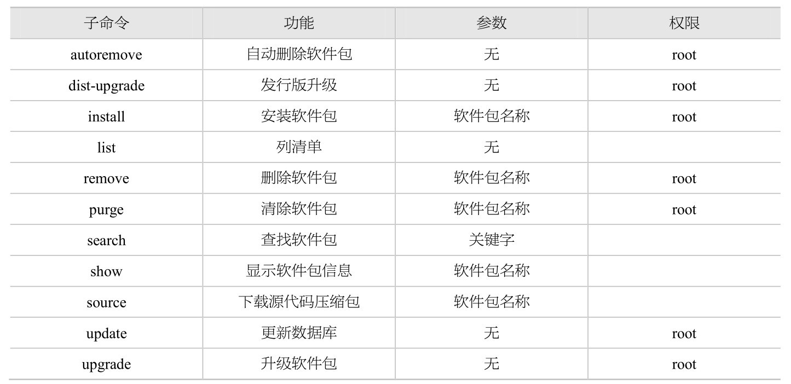

#### Ubuntu 都将软件仓库分成如下几类。

- main: Ubuntu 团队积极支持的、完全遵循自由软件版权协议的软件（除了一些二进制固件和字体以外）。
- restricted: 受限软件，虽然没有完全遵循自由软件版权协议，但在某些机器上是必需的，例如显卡制造商发行的二进制驱动。Ubuntu 团队正努力促使这些制造商加速这些软件的开源，以保证尽可能多的软件符合自由软件版权协议。
- universe: 来自 Linux 世界的各种开源软件，Canoical 公司不保证为它们提供定期的安全更新。其中一部分流行的或者支持良好的软件将会移入 main 库。
- multiverse: 多元化的、不满足 main 类版权协议的软件，有可能包含非自由软件或依赖非自由软件

